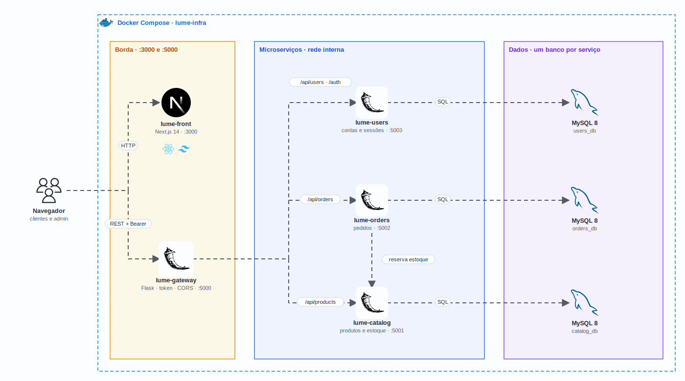

<p align="center">
  <picture>
    <source media="(prefers-color-scheme: dark)" srcset="docs/logo-dark.svg" />
    
  </picture>
</p>

<h1 align="center">
  Lume Store · Infra
</h1>

<p align="center">
  
</p>

<p align="center">
  <a href="https://skillicons.dev">
    
  </a>
</p>

## Qual a finalidade do projeto?

A **Lume Store** é uma loja online de tecnologia e estilo construída em **microserviços**: cada parte do negócio (usuários, catálogo e pedidos) é um serviço Flask independente, com o **seu próprio banco MySQL**, e tudo passa por um **API Gateway** que valida o login e roteia as chamadas. O front é uma loja completa em Next.js, com vitrine, carrinho, checkout, histórico de pedidos e painel administrativo.

Este repositório tem o `docker-compose` que sobe a stack inteira (5 aplicações + 3 bancos) com um comando, além das variáveis de ambiente e do teste de ponta a ponta.

## Arquitetura

<p align="center">
  
</p>

## O que foi construído

### Serviços

| Serviço | Porta | Repositório | Função |
|---|---|---|---|
| `lume-front` | 3000 | [lume-front](https://github.com/lume-store-org/lume-front) | Loja em Next.js |
| `lume-gateway` | 5000 | [lume-gateway](https://github.com/lume-store-org/lume-gateway) | Único ponto de entrada da API; valida o token e roteia |
| `lume-users` | interna (5003) | [lume-users](https://github.com/lume-store-org/lume-users) | Contas, login e sessões |
| `lume-catalog` | interna (5001) | [lume-catalog](https://github.com/lume-store-org/lume-catalog) | Produtos, categorias e estoque |
| `lume-orders` | interna (5002) | [lume-orders](https://github.com/lume-store-org/lume-orders) | Pedidos; reserva estoque no catálogo |
| `mysql-users`, `mysql-catalog`, `mysql-orders` | 3309, 3307, 3308 (só `127.0.0.1`) | · | Um banco por serviço |

Só o front e o gateway ficam expostos. Os microserviços conversam apenas pela rede interna do Docker, e todos os containers têm healthcheck.

### Segurança

| Ponto | Como foi resolvido |
|---|---|
| Credenciais | Senhas do MySQL só no `.env` (fora do git); a compose não sobe sem elas |
| Senhas dos usuários | Hash **scrypt com salt** (werkzeug) |
| Autenticação | Token de sessão validado no gateway em toda rota privada |
| Autorização | Headers internos `X-User-*` definidos pelo gateway; os enviados pelo cliente são descartados |
| Preço | Sempre do catálogo, nunca do navegador |
| Logs | O gateway não registra corpo de requisição nem token |
| Containers | Rodam sem root; bancos acessíveis só em `localhost` |

## Tecnologias utilizadas

- **Docker Compose:** orquestração local das 8 peças;
- **Python 3.12 + Flask 3 + Gunicorn:** gateway e microserviços;
- **MySQL 8:** um banco por microserviço;
- **Next.js 14 + React + TypeScript + Tailwind:** loja.

## Estrutura do repositório

```text
lume-infra/
├── docker-compose.yml     # Stack completa (builda os repositórios vizinhos)
├── .env.example           # Senhas e URLs (copie para .env)
├── scripts/smoke_test.py  # Teste de ponta a ponta pelo gateway
├── docs/                  # Logo, demo e diagrama
└── README.md
```

## Fluxo de funcionamento

1. O cliente navega na loja (`lume-front`), que chama a API em `:5000`.
2. O `lume-gateway` valida o token no `lume-users` e repassa a chamada ao serviço certo, com o usuário nos headers internos.
3. Ao fechar o pedido, o `lume-orders` pede ao `lume-catalog` para **reservar o estoque**; o catálogo baixa as quantidades numa transação e devolve os preços oficiais.
4. O pedido é gravado no banco de pedidos. Se algo falhar, o estoque é devolvido.
5. Cancelar um pedido pendente ou pago também devolve o estoque.

## Como rodar

Os seis repositórios precisam estar lado a lado:

```bash
for r in front gateway users catalog orders infra; do git clone https://github.com/lume-store-org/lume-$r; done
cd lume-infra
cp .env.example .env        # troque as senhas
docker compose up -d --build
```

| Endereço | O quê |
|---|---|
| http://localhost:3000 | Loja |
| http://localhost:5000/docs | Swagger da API |

Contas de teste: `cliente@lumestore.dev` / `senha123` e `admin@lumestore.dev` / `admin123`.

Para apagar tudo, inclusive os dados: `docker compose down -v`.

## Como validar a entrega

```bash
python3 scripts/smoke_test.py
```

O teste passa pelo gateway e confere 14 pontos:

- os três serviços online;
- rotas privadas exigindo login;
- cliente sem acesso a rotas de admin;
- header de admin forjado sendo ignorado;
- preço vindo do catálogo;
- estoque reservado, recusado quando falta e devolvido no cancelamento.

## Projeto Lume Store

| Repositório | Camada |
|---|---|
| [lume-front](https://github.com/lume-store-org/lume-front) | Loja (Next.js) |
| [lume-gateway](https://github.com/lume-store-org/lume-gateway) | API Gateway (Flask) |
| [lume-users](https://github.com/lume-store-org/lume-users) | Microserviço de usuários |
| [lume-catalog](https://github.com/lume-store-org/lume-catalog) | Microserviço de catálogo |
| [lume-orders](https://github.com/lume-store-org/lume-orders) | Microserviço de pedidos |
| [lume-infra](https://github.com/lume-store-org/lume-infra) | Docker Compose com a stack completa |

## Autor

**William Alves Coelho** · [@willtechdev](https://github.com/willtechdev)
